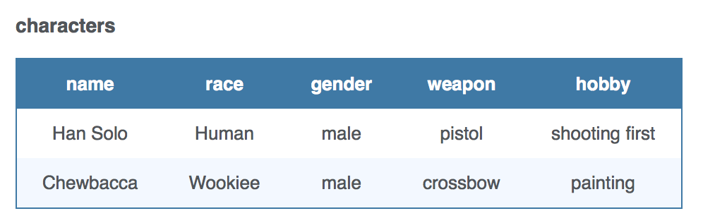

# postgreSQL Basics

## Learning Competencies
- Learn about postgreSQL
- Familiarize with Syntax & Datatypes of Postgres, Compare & constrast with other databases
- Build and work with Schema 
- Perform complex queries on Postgres

## Introduction

PostgreSQL is a powerful, open source object-relational database system. It has more than 15 years of active development and a proven architecture that has earned it a strong reputation for reliability, data integrity, and correctness. PostgreSQL runs on all major operating systems, including Linux, UNIX (AIX, BSD, HP-UX, SGI IRIX, Mac OS X, Solaris, Tru64), and Windows. This tutorial will give you quick start with PostgreSQL and make you comfortable with PostgreSQL programming.

#### What is PostgreSQL?
PostgreSQL (pronounced as post-gress-Q-L) is an open source relational database management system (DBMS) developed by a worldwide team of volunteers. PostgreSQL is not controlled by any corporation or other private entity and the source code is available free of charge.

#### Key Features of PostgreSQL
PostgreSQL runs on all major operating systems, including Linux, UNIX (AIX, BSD, HP-UX, SGI IRIX, Mac OS X, Solaris, Tru64), and Windows. It supports text, images, sounds, and video, and includes programming interfaces for C / C++, Java, Perl, Python, Ruby, Tcl and Open Database Connectivity (ODBC).

#### Procedural Languages Support
PostgreSQL supports four standard procedural languages, which allows the users to write their own code in any of the languages and it can be executed by PostgreSQL database server. These procedural languages are - PL/pgSQL, PL/Tcl, PL/Perl and PL/Python. Besides, other non-standard procedural languages like PL/PHP, PL/V8, PL/Ruby, PL/Java, etc., are also supported.

### DataTypes

#### Numeric Types
Numeric types consist of two-byte, four-byte, and eight-byte integers, four-byte and eight-byte floating-point numbers, and selectable-precision decimals. The following table lists the available types.

#### Monetary Types
The money type stores a currency amount with a fixed fractional precision. Values of the numeric, int, and bigint data types can be cast to money. Using Floating point numbers is not recommended to handle money due to the potential for rounding errors.

#### Character Types

The table given below lists the general-purpose character types available in PostgreSQL.

#### Binary Data Types
The bytea data type allows storage of binary strings as in the table given below.

#### Date/Time Types
PostgreSQL supports a full set of SQL date and time types, as shown in table below. Dates are counted according to the Gregorian calendar. Here, all the types have resolution of 1 microsecond / 14 digits except date type, whose resolution is day.

#### Boolean Type
PostgreSQL provides the standard SQL type Boolean. The Boolean data type can have the states true, false, and a third state, unknown, which is represented by the SQL null value.

#### Enumerated Type
Enumerated (enum) types are data types that comprise a static, ordered set of values. They are equivalent to the enum types supported in a number of programming languages.

Unlike other types, Enumerated Types need to be created using CREATE TYPE command. This type is used to store a static, ordered set of values. For example compass directions, i.e., NORTH, SOUTH, EAST, and WEST or days of the week as shown below-

```
CREATE TYPE week AS ENUM ('Mon', 'Tue', 'Wed', 'Thu', 'Fri', 'Sat', 'Sun');
```

#### Geometric Type
Geometric data types represent two-dimensional spatial objects. The most fundamental type, the point, forms the basis for all of the other types.

#### Network Address Type

PostgreSQL offers data types to store IPv4, IPv6, and MAC addresses. It is better to use these types instead of plain text types to store network addresses, because these types offer input error checking and specialized operators and functions.


#### Bit String Type
Bit String Types are used to store bit masks. They are either 0 or 1. There are two SQL bit types: bit(n) and bit varying(n), where n is a positive integer.

#### Text Search Type
This type supports full text search, which is the activity of searching through a collection of natural-language documents to locate those that best match a query.

#### UUID Type

A UUID (Universally Unique Identifiers) is written as a sequence of lower-case hexadecimal digits, in several groups separated by hyphens, specifically a group of eight digits, followed by three groups of four digits, followed by a group of 12 digits, for a total of 32 digits representing the 128 bits.

An example of a UUID is − 550e8400-e29b-41d4-a716-446655440000

#### XML Type
The XML data type can be used to store XML data. For storing XML data, first you have to create XML values using the function xmlparse as follows −


```
XMLPARSE (DOCUMENT '<?xml version="1.0"?>
<tutorial>
<title>PostgreSQL Tutorial </title>
   <topics>...</topics>
</tutorial>')

XMLPARSE (CONTENT 'xyz<foo>bar</foo><bar>foo</bar>')
```

#### JSON Type
The json data type can be used to store JSON (JavaScript Object Notation) data. Such data can also be stored as text, but the json data type has the advantage of checking that each stored value is a valid JSON value. There are also related support functions available, which can be used directly to handle JSON data type as follows.

``` array_to_json('{{1,5},{99,100}}'::int[])``` 
to
```[[1,5],[99,100]]```

```row_to_json(row(1,'foo'))```
to 
```{"f1":1,"f2":"foo"}```


#### Array Type
PostgreSQL gives the opportunity to define a column of a table as a variable length multidimensional array. Arrays of any built-in or user-defined base type, enum type, or composite type can be created.

Declaration of Arrays
Array type can be declared as
```
CREATE TABLE monthly_savings (
   name text,
   saving_per_quarter integer[],
   scheme text[][]
);
```
or by using the keyword "ARRAY" as

```
CREATE TABLE monthly_savings (
   name text,
   saving_per_quarter integer ARRAY[4],
   scheme text[][]
);
```


Note: There are a lot of other DataTypes besides these one's. Go Explore [here](https://www.tutorialspoint.com/postgresql/postgresql_data_types.htm)


### PostgreSQL Schema

A schema is a named collection of tables. A schema can also contain views, indexes, sequences, data types, operators, and functions. Schemas are analogous to directories at the operating system level, except that schemas cannot be nested. PostgreSQL statement CREATE SCHEMA creates a schema.

Syntax
The basic syntax of CREATE SCHEMA is as follows −
```
CREATE SCHEMA name;
```
Where name is the name of the schema.


#### Syntax to Create Table in Schema
The basic syntax to create table in schema is as follows −
```
CREATE TABLE myschema.mytable (
...
);
```

#### Example
Let us see an example for creating a schema. Connect to the database testdb and create a schema myschema as follows −

```
testdb=# create schema myschema;
CREATE SCHEMA
```

The message "CREATE SCHEMA" signifies that the schema is created successfully.

Now, let us create a table in the above schema as follows −

```
testdb=# create table myschema.company(
   ID   INT              NOT NULL,
   NAME VARCHAR (20)     NOT NULL,
   AGE  INT              NOT NULL,
   ADDRESS  CHAR (25),
   SALARY   DECIMAL (18, 2),
   PRIMARY KEY (ID)
);
```

This will create an empty table. You can verify the table created with the command given below −

```
testdb=# select * from myschema.company;
```


This would produce the following result −

```
 id | name | age | address | salary
----+------+-----+---------+--------
(0 rows)
```

#### Syntax to Drop Schema

To drop a schema if it is empty (all objects in it have been dropped), use the command −

```
DROP SCHEMA myschema;
```

To drop a schema including all contained objects, use the command −

```
DROP SCHEMA myschema CASCADE;
```

#### Advantages of using a Schema

- It allows many users to use one database without interfering with each other.
- It organizes database objects into logical groups to make them more manageable.
- Third-party applications can be put into separate schemas so they do not collide with the names of other objects.


### SYNTAX

#### 1. Create Table

When creating new tables in SQL the CREATE TABLE statement is called. It expects as it's arguments all the columns we want in the table, as well as the their data types.

Here we are creating a simple table called months. It consists of 3 columns:

id - The number of the month in the calendar year (integer).
name - Name of the month (string, maximum of 10 characters).
days - The number of days in that month (integer).
And this is how the respective SQL looks like:

CREATE TABLE months (id int, name varchar(10), days int);
Also when creating tables, it's advisable to add a primary key to one of the columns. It will help keep entries unique and will speed up select queries. We won't be covering them in this lesson but you can read about them [here](https://www.w3schools.com/sql/sql_primarykey.asp).

#### 2. Insert Rows

Now let's populate months with a few rows of information. Adding entries to a table is done via the INSERT statement. There are two different ways to use it:

The first way does not specify the column names where the data will be inserted, it only expects the values and leaves it up to the developer to provide all the data in the correct order.

```INSERT INTO months VALUES (1,'January',31);```
The above is shorter, but there is a major issue - if we add additional columns in the future, the query will break. The preferred way to write this is to include the columns:

```INSERT INTO months (id,name,days) VALUES (2,'February',29);```


```
INSERT INTO months (id,name,days) 
VALUES (3, "March", 31);
```

#### 3. Select

Select queries are our best friend when we want to fetch data from the database. They are used all the time so this lesson is going to spend a lot of time covering them.

The most simple SELECT example would be this query, which will return all the columns and rows from the characters table:

```SELECT * FROM "characters"```
The asterisk (*) means that we want to grab all of the columns, without excluding anything. Since SQL databases usually consist of more then one table, the FROM keyword is required to specify which table we want to look in.

Sometimes we don't want all of the columns in a table. SQL allows us to choose and get only the ones we need: instead of putting the asterisk (*), we write the names of the desired columns.

```SELECT name, weapon FROM "characters"```
Also, in many cases we want the results be sorted in a certain way. In SQL we do this with ORDER BY. It can take an optional modifier - ASC (default) or DESC for sorting direction:

```SELECT name, weapon FROM "characters" ORDER BY name DESC```



```
SELECT name, weapon 
FROM "characters"
```

#### 4. Where

You learned how to select only specific columns, but what if only certain rows need to be acquired. To the rescue here comes the ```WHERE``` clause, allowing us to filter data depending on a condition.

In this query we select only those entries from the characters table, who use a pistol to fight baddies.


```
SELECT * 
FROM "characters" 
WHERE weapon = "pistol";
```

Bonus: Create a SELECT query that fetches the name, race and hobby for those characters who are "Wookiees".


#### 5. AND / OR

WHERE conditions can be made as specific as you like, with the help of the logical operators (AND,OR) and math-like comparisons (=,<,>,<=,>=,<>).

Here we have a table containing the top 4 most sold albums of all time. Let's select those of them that are classified as rock and have sold under 50 million copies. This can easily be done by placing the AND operator between the two statements.


```
SELECT * 
FROM albums 
WHERE genre = 'rock' AND sales_in_millions <= 50 
ORDER BY released
```


#### 6. In/Between/Like

WHERE statements also support a few special commands, allowing a quick way to check commonly used queries. They are:

- IN - compares the column to multiple possible values, resolves true if it matches at least one
- BETWEEN - checks if a value is within a range
- LIKE - searches for a specific pattern

For example if we want to do a query selecting the pop and soul albums from our table, we can use ```IN("value1","value2").```

SELECT * FROM albums WHERE genre IN ('pop','soul');
If we want to get all the albums released between 1975 and 1985 we would write:

```SELECT * FROM albums WHERE released BETWEEN 1975 AND 1985;```


```
SELECT * 
FROM albums 
WHERE genre IN ('pop','soul');
```

Bonus: All of the above operations can be reversed by placing NOT in front of them. Try using NOT BETWEEN to get the albums released before 1975 and after 1985.

#### 7. Functions

SQL is packed with functions that do all sorts of helpful stuff. Here are some of the most regularly used ones:

- ```COUNT()``` - returns the number of rows
- ```SUM()``` - returns the total sum of a numeric column
- ```AVG()``` - returns the average of a set of values
- ```MIN() / MAX()``` - gets the minimum/maximum value from a column

To get the most recent year in our table we can run:


SELECT MAX(released) FROM albums;

Bonus: Try combining SUM with a WHERE clause and fetch the combined sales of all rock albums.

#### 8. Nested Select

In the previous point we learned how to do simple calculations with data. If we want to actually use the result from these calculations, often times a nested query (also known as sub select) is necessary. Let's say we want to get the artist, album and release year for the oldest album in the table.

We know how to get these specific columns:

```SELECT artist, album, released FROM albums;```
We also know how to get the earliest year:

```SELECT MIN(released) FROM album;```
All that is needed now is to combine the two with the help of WHERE:


```
SELECT artist,album,released 
FROM albums 
WHERE released = (
 SELECT MIN(released) FROM albums
);
```

Bonus: Modify the above statement to return the album, genre and year for the newest album.

#### 9. Joining Tables

In more complex databases, most of the time there are several tables connected to each other in some way. For example, below in the editor are two tables about video games and video game developers.

In the video_games table there is a developer column, but it holds an integer instead of the name of the developer. This number represents the id of the respective developer from the game_developers table, linking logically the two sheets, allowing us to use the information stored in both of them at the same time.

If we want to create a query that returns everything we need to know about the games, we can use ```INNER JOIN``` to acquire the columns from both tables.


```
SELECT video_games.name, video_games.genre, game_developers.name, game_developers.country 
FROM video_games 
INNER JOIN game_developers 
ON video_games.developer_id = game_developers.id;
```

#### 10. Aliases

If you look at the previous example you'll notice that there are two columns called name. That's confusing, so let's change it by setting an alias to one of the repeating columns: name from game_developers will appear as developer.

We can also shorten the query drastically by setting aliases to the table names: video_games becomes games and game_developers becomes devs.


```
SELECT games.name, games.genre, devs.name AS developer, devs.country 
FROM video_games AS games 
INNER JOIN game_developers AS devs 
ON games.developer_id = devs.id;
```

#### 11. Update

Often times we have to change the data in some of the rows. In SQL this is done via the ```UPDATE``` statement.

The usage of ```UPDATE``` consists of

Choosing the table where the record we want to change is located.
Setting new value(s) for the wanted column(s).
Selecting with ```WHERE``` which of the rows we want to update. If this is omitted all rows in the table will change.
Here is a table of some of the highest rated TV series of all time. There is one tiny problem about it though, the show Game of Thrones is described as comedy, which it clearly isn't. Let's fix that!


```
UPDATE tv_series 
SET genre = 'drama' 
WHERE id = 2;
```


#### 12. Delete Rows

Deleting a table row through SQL is a really simple process. All that is needed is to select the right table and row we want to remove.


```
DELETE FROM tv_series 
WHERE id = 4
```

Important: Always be cautions when writing a DELETE statement and make sure there is a WHERE clause attached. Without it all table rows will be deleted!


#### 13. Deleting Tables

If we want to delete all the rows, but leave the table itself, the proper command is TRUNCATE:
```
TRUNCATE TABLE table_name;
```
In the case when we actually want to remove every trace of the table whatsoever, the DROP command comes into play:

```
DROP TABLE table_name;
```
Be very careful with these commands. There is no undo!


### Try SQL in other environments

#### SQL for data analysis. 
These days, SQL is often used to analyze data that comes from all sorts of places. One way that you can start analyzing data immediately is with Google's BigQuery, which includes a SQL-like language, and lets you upload data or use public data sets. Read the [BigQuery](https://cloud.google.com/bigquery/docs/reference/legacy-sql) documentation or read this [BigQuery tutorial](https://www.thinkful.com/learn/google-bigquery-tutorial/).

#### SQL on the server-side. 
SQL can be used to manage the data in a app's server-side database. A user uses the app via the "frontend" (webpage or mobile app), the frontend sends HTTP requests to the "backend" (server), and the backend issues SQL commands to the database. You can set up a server-side app on your own computer using many different languages/frameworks, two popular stacks are [LAMP](https://en.wikipedia.org/wiki/LAMP_%28software_bundle%29) and [LAPP](https://www.turnkeylinux.org/lapp).

#### SQL in a webpage.
If you don't have a server setup or data to analyze, you could use SQLite inside a webpage, to store data that the user creates while using the webpage. The data won't be stored when the user leaves the page, however. You can spin-off this example of [using SQLite in a webpage](https://www.khanacademy.org/computer-programming/using-sqlite-inside-a-webpage/5618461699080192).


## Exploration
- [SQL Fiddle](http://sqlfiddle.com) - online tool for testing and sharing SQL
- SQL Features: [indexes and query planning](https://www.sqlite.org/queryplanner.html), [constraints](http://beginner-sql-tutorial.com/sql-integrity-constraints.htm), [triggers](https://en.wikipedia.org/wiki/Database_trigger), [views](https://en.wikipedia.org/wiki/View_%28SQL%29), and [foreign keys](https://en.wikipedia.org/wiki/Foreign_key)
  - It's best if you know which SQL environment you'll be using those features in first, so you can read the most accurate documentation for it.
- Go deeper on databases: [relational design theory](https://en.wikipedia.org/wiki/Relational_model), [relational algebra](https://en.wikipedia.org/wiki/Relational_algebra), [unified modeling language](https://en.wikipedia.org/wiki/Unified_Modeling_Language)
- Stanford's self-paced [Intro to Databases class](https://lagunita.stanford.edu/courses/DB/2014/SelfPaced/about)
